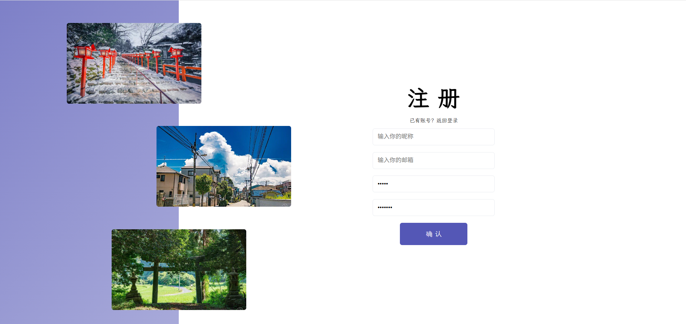
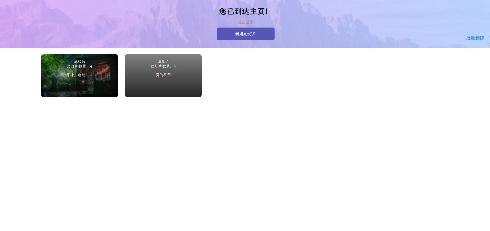
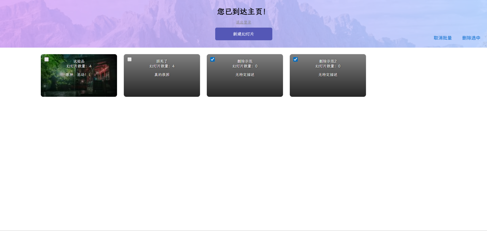
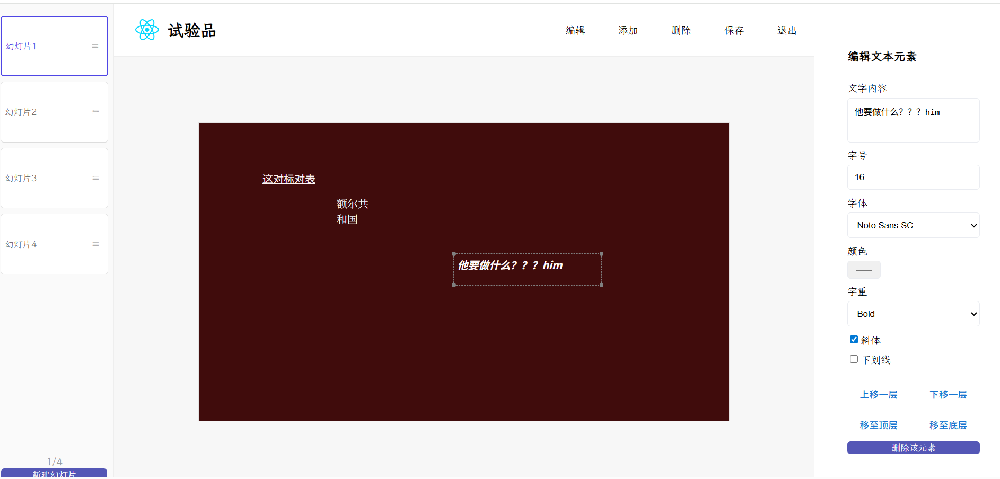

# 🪄 Presto 产品说明书  

## 🎯 产品定位  
Presto 是一个轻量级在线演示文稿制作工具，灵感来源于 *slides.com*，目标是提供一个简单、直观的网页应用，用户无需安装软件即可快速创建和编辑演示文稿。  

---

本产品已经部署前端至[此网站](https://presto-blush.vercel.app/)，但因为后端出了问题，无法部署到vercel，想要查看完整效果需要下载frontend文件夹，并创建.env文件，定义以下内容：
PORT = 5005
MONGO_URL = 你的MONGO数据库
JWT_SECRET = 你的JWT_SECRET
即可使用，前端会因为无法正常连接后端端口转而连接本地5005接口。

---

## 1. 登录 / 注册 / 注销**  
  - 支持用户注册和登录（邮箱 + 密码）。
  - 登录界面左边栏三张演示图片会每隔一段时间切换。
  - 登录失败有动画效果提示框出现。  
  - 登录后进入仪表盘。
  - 点击没有账号进入注册界面。
  - 注册时需要两次密码相同才能成功。
  - 页面右上角始终提供“退出登录”按钮。

- **登录界面**


- **注册界面**


- **提示信息**

本项目用自定义提示框取代了默认alert。

```html
{showError && (
  <div className={`overlay error-overlay ${error ? 'visible' : ''}`} onClick={() => setError('')}>
    <div className={`error-message ${animateIn ? 'show' : 'hide'}`}>
      {error}
    </div>
  </div>
)}
```

```css
.error-message {
    transform: translateY(-120%);
    opacity: 0;
    transition: transform 0.4s ease, opacity 0.4s ease;
}

.error-message.show {
    transform: translateY(0);
    opacity: 1;
}

.error-message.hide {
    transform: translateY(-120%);
    opacity: 0;
}
```

```ts
useEffect(() => {
  if (error) {
    setShowError(true);
    requestAnimationFrame(() => {
      setAnimateIn(true);
    });
  } else {
    setAnimateIn(false);
    const t = setTimeout(() => setShowError(false), 400);
    return () => clearTimeout(t);
  }
}, [error]);
```

- **图片切换**
使用 setTimeout 实现递归定时器，形成无限循环，让多对图片交替切换显示，并且通过css的transition动画营造淡入淡出效果。每对图片的启动时间有间隔，避免所有图片同时切换。每轮切换过程：先淡入 → 1 秒后换图 + 淡出 → 4 秒后再次触发。

```ts
useEffect(() => {
  const pairs = [
    [show1, show4],
    [show2, show5],
    [show3, show6],
  ];
  const timers: NodeJS.Timeout[] = [];

  pairs.forEach(([imgA, imgB], index) => {
    const delay = (index + 1) * 500; // 0.5s / 1s / 1.5s
    let toggle = false;

    const cycle = () => {
      setFade(prev => {
        const newFade = [...prev];
        newFade[index] = true;
        return newFade;
      });

      const t1 = setTimeout(() => {
        setImages(prev => {
          const newImages = [...prev];
          newImages[index] = toggle ? imgA : imgB;
          return newImages;
        });

        setFade(prev => {
          const newFade = [...prev];
          newFade[index] = false;
          return newFade;
        });

        toggle = !toggle;
        const t2 = setTimeout(cycle, 4000);
        timers.push(t2);
      }, 1000);

      timers.push(t1);
    };

    const starter = setTimeout(cycle, delay);
    timers.push(starter);
  });

  return () => {
    timers.forEach(t => clearTimeout(t));
  };
}, []);
```

```html


```

```css
.fadeImg {
  transition: opacity 1s ease-in-out;
  opacity: 1;
}

.fadeOut {
  opacity: 0;
}
```

## 2. 仪表盘 
  - 显示用户所有演示文稿卡片。每张卡片包括：缩略图、标题、描述、幻灯片数量。
  - 点击卡片进入该幻灯片编辑界面。
  - 支持 **新建演示文稿**（输入标题、描述、缩略图）。  
  - 支持 **删除演示文稿**（二次确认 Modal）。  
  - 支持 **批量删除模式**（勾选卡片 → 删除所选）。






---

## 3. 幻灯片编辑
- **幻灯片列表与切换**  
  - 每个演示文稿包含多张幻灯片。
  - 当没有幻灯片时点击幻灯片显示平台可新建第一张幻灯片。  
  - 左侧面板显示幻灯片列表，可拖拽重新排序。  
  - 支持上下翻页（按钮 / 键盘方向键 / 鼠标滚轮）。
  - 点击左侧边栏底部增加一张幻灯片，默认背景为白色。


```ts
const sortedSlides = useMemo(() => {
    return presentation?.slides
        ? [...presentation.slides].sort((a, b) => a.index - b.index)
        : [];
}, [presentation]);

const gotoIndex = (i: number) => {
    const max = sortedSlides.length - 1;
    const clamped = Math.max(0, Math.min(max, i));
    setCurrentIndex(clamped);
    setSelectedElementIndex(null);
};

useEffect(() => {
    const onKey = (e: KeyboardEvent) => {
        const target = e.target as HTMLElement;
        if (target.tagName === "INPUT" || target.tagName === "TEXTAREA" || target.isContentEditable) return;
        if (sortedSlides.length === 0) return;
        if (e.key === "ArrowLeft") {
            e.preventDefault();
            gotoIndex(currentIndex - 1);
        } else if (e.key === "ArrowRight") {
            e.preventDefault();
            gotoIndex(currentIndex + 1);
        }
    };
    window.addEventListener("keydown", onKey);
    return () => window.removeEventListener("keydown", onKey);
}, [sortedSlides, currentIndex]);

const onStageWheel = (e: React.WheelEvent<HTMLDivElement>) => {
    if (!presentation || presentation.slides.length === 0) return;
    if (e.deltaY > 0) {
        gotoIndex(currentIndex + 1);
    } else if (e.deltaY < 0) {
        gotoIndex(currentIndex - 1);
    }
};
```
- **修改文件信息**


- **幻灯片背景**  
  - 支持三种背景类型：纯色 / 渐变 / 图片。  
  - 渐变支持输入方向与两种颜色。  
  - 上传图片会自动压缩到合适分辨率。  


- **幻灯片渲染**
动画片信息会以结构体形式储存，被发送过来，其包含了位置，层级，大小等信息。要想表现出幻灯片的图片效果，就要把其中包含的元素信息在一定的容器范围内渲染出来：
```html
<main className={styles.previewSlide}>
    <div className={styles.slideWrapper}>
        <div
        className={`${styles.slideContent} ${animate ? styles.fadeOut : ""}`}
        style={
            slide.background.type === "color"
            ? { backgroundColor: presentation.slides[animatingIndex].background.value }
            : slide.background.type === "image"
            ? {
                backgroundImage: `url(${presentation.slides[animatingIndex].background.value})`,
                backgroundSize: "cover",
                backgroundRepeat: "no-repeat",
                backgroundPosition: "center",
                }
            : {
                backgroundImage: presentation.slides[animatingIndex].background.value,
                backgroundRepeat: "no-repeat",
                backgroundPosition: "center",
                }
        }
        >
        {presentation.slides[animatingIndex].content.map((el, idx) => {
        const centerX = el.position.x + el.size.width / 2;
        const centerY = el.position.y + el.size.height / 2;
        const offsetX = (centerX - slideCenterX) * scale;
        const offsetY = (centerY - slideCenterY) * scale;
        const scaledX =
            scaledCenterX + offsetX - (el.size.width * scale) / 2;
        const scaledY =
            scaledCenterY + offsetY - (el.size.height * scale) / 2;

        if (el.type === "text") {
            return (
            <div
                key={idx}
                style={{
                position: "absolute",
                left: scaledX,
                top: scaledY,
                width: el.size.width * scale,
                height: el.size.height * scale,
                fontSize: `${el.properties.fontSize * scale}px`,
                fontFamily: el.properties.fontFamily,
                fontWeight:
                    el.properties.fontWeight === "bold"
                    ? 700
                    : el.properties.fontWeight === "light"
                    ? 300
                    : 400,
                fontStyle: el.properties.fontStyle,
                textDecoration: el.properties.textDecoration,
                color: el.properties.color,
                padding: `${5 * scale}px`,
                whiteSpace: "normal",
                overflowWrap: "break-word",
                wordBreak: "break-word",
                zIndex: el.layer,
                }}
            >
                {el.properties.text}
            </div>
            );
        }
        if (el.type === "image") {
            return (
            
            );
        }
        if (el.type === "video") {
            return (
            <iframe
                key={idx}
                src={`${el.properties.url}${
                el.properties.autoPlay ? "?autoplay=1&mute=1" : ""
                }`}
                style={{
                position: "absolute",
                left: scaledX,
                top: scaledY,
                width: el.size.width * scale,
                height: el.size.height * scale,
                border: "none",
                zIndex: el.layer,
                }}
                allow="accelerometer; autoplay; clipboard-write; encrypted-media; gyroscope; picture-in-picture"
                allowFullScreen
            />
            );
        }
        return null;
        })}
        </div>
    </div>
</main>
```
---

### 4. 元素管理
- **元素类型**  
  - 文本框  
  - 图片  
  - 视频（YouTube Embed，支持自动播放）  


- **元素操作**  
  - 单击选中元素 → 出现边框 + 四角缩放点。  
  - 支持拖拽移动。  
  - 支持四角缩放（保持不超出幻灯片边界）。  
  
```ts
import type { DragEndEvent } from "@dnd-kit/core";
```

```ts
const handleResizeStart = (e: React.MouseEvent, idx: number, dir: string) => {
    e.stopPropagation();
    setResizingIndex(idx);
    setResizeDir(dir);
    setDragStart({ x: e.clientX, y: e.clientY });
    const currentSlide = presentation!.slides[currentIndex];
    const el = currentSlide.content[idx];
    setElementStart({ x: el.position.x, y: el.position.y });
    setResizeStartSize({ width: el.size.width, height: el.size.height });
};

const handleMouseDown = (e: React.MouseEvent, idx: number) => {
    e.stopPropagation();
    if (!presentation) return;
    setDraggingIndex(idx);
    setDragStart({ x: e.clientX, y: e.clientY });
    const currentSlide = presentation.slides[currentIndex];
    const el = currentSlide.content[idx];
    setElementStart({ x: el.position.x, y: el.position.y });
};

const handleMouseMove = (e: MouseEvent) => {
    if (!presentation) return;
    const updatedSlides = [...presentation.slides];
    const currentSlide = updatedSlides[currentIndex];
    let modified = false;
    if (draggingIndex !== null && dragStart && elementStart) {
        const dx = e.clientX - dragStart.x;
        const dy = e.clientY - dragStart.y;
        const el = currentSlide.content[draggingIndex];
        const newX = elementStart.x + dx;
        const newY = elementStart.y + dy;
        const { x, y } = clampElementPosition(el, newX, newY, 800, 450);
        if (el.position.x !== x || el.position.y !== y) {
            el.position = { x, y };
            modified = true;
        }
    }
    if (resizingIndex !== null && dragStart && elementStart && resizeDir && resizeStartSize) {
        const dx = e.clientX - dragStart.x;
        const dy = e.clientY - dragStart.y;
        const el = currentSlide.content[resizingIndex];
        let newWidth = resizeStartSize.width;
        let newHeight = resizeStartSize.height;
        let newX = elementStart.x;
        let newY = elementStart.y;
        if (resizeDir.includes("right")) newWidth = Math.max(7, resizeStartSize.width + dx);
        if (resizeDir.includes("bottom")) newHeight = Math.max(7, resizeStartSize.height + dy);
        if (resizeDir.includes("left")) {
            newWidth = Math.max(7, resizeStartSize.width - dx);
            newX = elementStart.x + dx;
        }
        if (resizeDir.includes("top")) {
            newHeight = Math.max(7, resizeStartSize.height - dy);
            newY = elementStart.y + dy;
        }

        if (el.size.width !== newWidth || el.size.height !== newHeight || el.position.x !== newX || el.position.y !== newY) {
            el.size = { width: newWidth, height: newHeight };
            el.position = { x: newX, y: newY };
            modified = true;
        }
    }
    if (modified) {
        const updated: Presentation = { ...presentation, slides: updatedSlides };
        setPresentation(updated);
        setDirty(true);
    }
};

const handleMouseUp = () => {
    setDraggingIndex(null);
    setDragStart(null);
    setElementStart(null);
    setResizingIndex(null);
    setResizeDir(null);
    setResizeStartSize(null);
};
```

```ts
{selectedElementIndex === idx && (
    <>
    <div className={styles.resizeHandle} style={{ left: -3, top: -3, cursor: "nwse-resize" }} onMouseDown={(e) => handleResizeStart(e, idx, "top-left")} />
    <div className={styles.resizeHandle} style={{ right: -3, top: -3, cursor: "nesw-resize" }} onMouseDown={(e) => handleResizeStart(e, idx, "top-right")} />
    <div className={styles.resizeHandle} style={{ left: -3, bottom: -3, cursor: "nesw-resize" }} onMouseDown={(e) => handleResizeStart(e, idx, "bottom-left")} />
    <div className={styles.resizeHandle} style={{ right: -3, bottom: -3, cursor: "nwse-resize" }} onMouseDown={(e) => handleResizeStart(e, idx, "bottom-right")} />
    </>
)}
```

- **文本框属性**  
  - 文本内容实时编辑。  
  - 字体大小 / 字体系列（Noto Sans、Noto Serif、LXGW WenKai）。  
  - 字重（Light / Regular / Bold）。  
  - 样式（斜体 / 下划线）。  
  - 文字颜色。 



- **图片属性**   
  - 支持旋转 / 翻转。  
  - 支持调整亮度、对比度、饱和度、不透明度。 


- **视频属性**  
  - 可修改 YouTube URL。  
  - 支持开关自动播放。  
  - 支持播放/暂停按钮。  


- **元素层级移动功能**
  - 支持调整层级：上移 / 下移 / 置顶 / 置底。  
  - 支持删除选中元素（带确认 Modal）。

- **注销/确认保存**
 - 平常的修改只是修改被下载并引用的presentation文件，只有当确认保存后，文件的更改才会被上传到数据库。
 - 退出到主页或是注销账号时，如果有修改，会自动弹出对话框确认保存。


原理是设置一项参数为dirty，当进行修改时，则setDirty(true)，在退出时确认dirty的值。

---

### 5. 预览界面
- **实时翻看**  
  - 支持上下翻页（键盘方向键 / 鼠标滚轮）。
  - 翻页时应用幻灯片消失动画效果。


- **下载为PDF**  
  - 点击保存每页幻灯片为图片模式，输出同名PDF文件。
  - 实际上的原理为在可见页面以外的地方将全部幻灯片渲染出来，并使用"html2canvas"截图，最后遍历，用"jspdf"将其转换为pdf。

---


## ⏳ 尚未实现或部分实现功能
- Token不具备长时间保存功能，刷新页面后只能返回登录界面重新开始。  
- 未完成可支持自动识别语言和高亮的插入代码功能。  
- 幻灯片修订历史功能未实现。    

---

📖 **总结**：  
该版本贴近真实的演示文稿编辑器，已经是一个可用的最小可行产品（MVP）。  